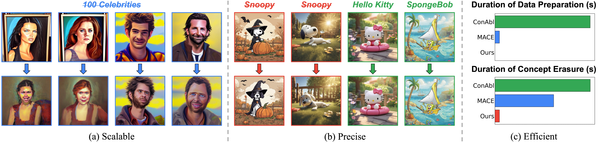

# SPEED
This is the official Pytorch implementation of our paper:

> [SPEED: Scalable, Precise, and Efficient Concept Erasure for Diffusion Models](https://arxiv.org/abs/2503.07392)
>
> Ouxiang Li, Yuan Wang, Xinting Hu, Houcheng Jiang, Tao Liang, Yanbin Hao, Guojun Ma, Fuli Feng



**Three characteristics of our proposed method, SPEED.** <span style="color:#4285F4"><b>  (a) Scalable:</b></span> SPEED seamlessly scales from single-concept to large-scale multi-concept erasure (e.g., 100 celebrities) without additional design.  <span style="color:#34A853"><b>(b) Precise:</b></span> SPEED precisely removes the target concept (e.g., *Snoopy*) while preserving the semantic integrity for non-target concepts (e.g., *Hello Kitty* and *SpongeBob*).  <span style="color:#EA4335"><b>(c) Efficient:</b></span> SPEED can immediately erase 100 concepts within 5 seconds, achieving a ×350 speedup over the state-of-the-art (SOTA) method.

## News
- `2025/03` :star2: Code and checkpoints are released.

## Requirements

Install the environment as follows:

```python
# create conda environment
conda create -n SPEED -y python=3.10
conda activate SPEED
# install pytorch 
pip install torch==2.3.0 torchvision==0.18.0
# install other dependencies
pip install -r requirements.txt
```

## Concept Erasure with SPEED

### Model Editing

```python
# Instance Erasure
CUDA_VISIBLE_DEVICES=0 python train_erase_null.py \
    --target_concepts "Snoopy, Mickey, Spongebob" --anchor_concepts "" \
    --retain_path "data/instance.csv" --heads "concept"

# Artistic Style Erasure
CUDA_VISIBLE_DEVICES=0 python train_erase_null.py \
    --target_concepts "Van Gogh" --anchor_concepts "art" \
    --retain_path "data/style.csv" --heads "concept"

# 10-Celebrity Erasure
CUDA_VISIBLE_DEVICES=0 python train_erase_null.py \
    --target_concepts "Adam Driver, Adriana Lima, Amber Heard, Amy Adams, Andrew Garfield, Angelina Jolie, Anjelica Huston, Anna Faris, Anna Kendrick, Anne Hathaway" \
    --anchor_concepts "person" \
    --retain_path "data/10_celebrity.csv" --heads "concept"
```

### Image Sampling

```python
# Instance Erasure
CUDA_VISIBLE_DEVICES=0 python sample.py \
    --erase_type 'instance' \
    --target_concept 'Snoopy, Mickey, Spongebob' \
    --contents 'Snoopy, Mickey, Spongebob, Pikachu, Hello Kitty' \
    --mode 'original, edit' \
    --edit_ckpt '{checkpoint_path}' \
    --num_samples 10 --batch_size 10 \
    --save_root 'logs/instance'

# Artistic Style Erasure
CUDA_VISIBLE_DEVICES=0 python sample.py \
    --erase_type 'style' \
    --target_concept 'Van Gogh' \
    --contents 'Van Gogh, Picasso, Monet, Paul Gauguin, Caravaggio' \
    --mode 'original, edit' \
    --edit_ckpt '{checkpoint_path}' \
    --num_samples 10 --batch_size 10 \
    --save_root 'logs/style'
# 10-Celebrity Erasure
CUDA_VISIBLE_DEVICES=0 python sample2.py \
    --erase_type "10_celebrity" \
    --target_concept "10_celebrity" \
    --contents "erase, retain" \
    --mode "original, edit" \
    --edit_ckpt '{checkpoint_path}' \
    --num_samples 1 --batch_size 10 \
    --save_root "logs/multi_celebrity"
```

In the command above, you can configure the `--mode` to determine the sampling mode:

- **`original`**: Generate images using the original Stable Diffusion model.
- **`edit`**: Generate images with the erased checkpoint.


## Metrics Evaluation

### Pre-trained Model Sampling

We first generate images from the pre-trained model as a baseline for subsequent comparisons, and these images are also used to calculate FID.

```python
bash pretrain/pretrain_sample.sh
```

This script facilitates to sample the original images on few-concept erasure (`instance`, `style`), multi-concept (`10/50/100 celebrities`) erasure, and MS-COCO generations (`coco`).

### On Few-Concept Erasure

You can directly reproduce our results using this script, which consists three steps: (1) model editing, (2) image sampling, and (3) evaluation (CS and FID).

```python
bash scripts/eval_few.sh
```

### On Multi-Concept Erasure

This script consists of two steps: (1) model editing and (2) image sampling.

```python
bash scripts/eval_multi.sh
```

In evaluation, we follow MACE's setup by introduing `GIPHY Celebrity Detector`, you can refer to the [GCD installation guideline](https://github.com/Shilin-LU/MACE/tree/main/metrics) and then calculate the GCD accuracy for both `erase` and `retain` sets.

```python
conda activate GCD
CUDA_VISIBLE_DEVICES=0 python metrics/evaluate_by_GCD.py --image_folder '{image_folder_path}'
```

### On Implicit Concept Erasure

You can directly run the following script for fast evaluation, which consists of: (1) model editing, (2) I2P image sampling, and (3) NudeNet detection.

```python
bash scripts/eval_nudity.sh
```


## Model Card

We provide several edited models with SPEED on Stable Diffusion v1.4.

| Concept Erasure Task | Edited Model |
|---|---|
| Few-Concept Erasure | [Link](https://rec.ustc.edu.cn/share/20312400-fe43-11ef-bbbc-4721580c9837) | 
| Multi-Concept Erasure | [Link](https://rec.ustc.edu.cn/share/2e96f430-fe43-11ef-b572-97a879666bd2) | 
| Implicit Concept Erasure | [Link](https://rec.ustc.edu.cn/share/36aa5250-fe43-11ef-968b-6123e5c640c6) | 


## Citation
If you find the repo useful, please consider citing.
```
@misc{li2025speedscalablepreciseefficient,
      title={SPEED: Scalable, Precise, and Efficient Concept Erasure for Diffusion Models}, 
      author={Ouxiang Li and Yuan Wang and Xinting Hu and Houcheng Jiang and Tao Liang and Yanbin Hao and Guojun Ma and Fuli Feng},
      year={2025},
      eprint={2503.07392},
      archivePrefix={arXiv},
      primaryClass={cs.CV},
      url={https://arxiv.org/abs/2503.07392}, 
}
```