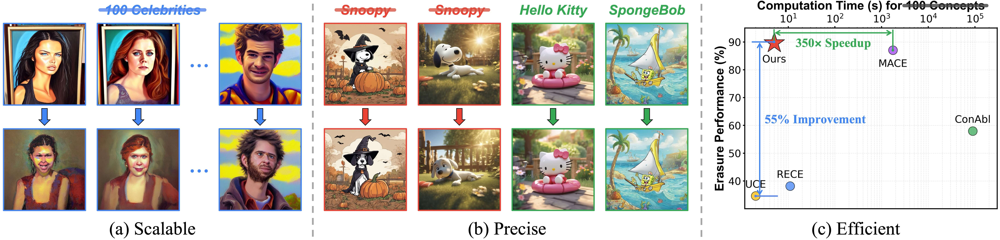
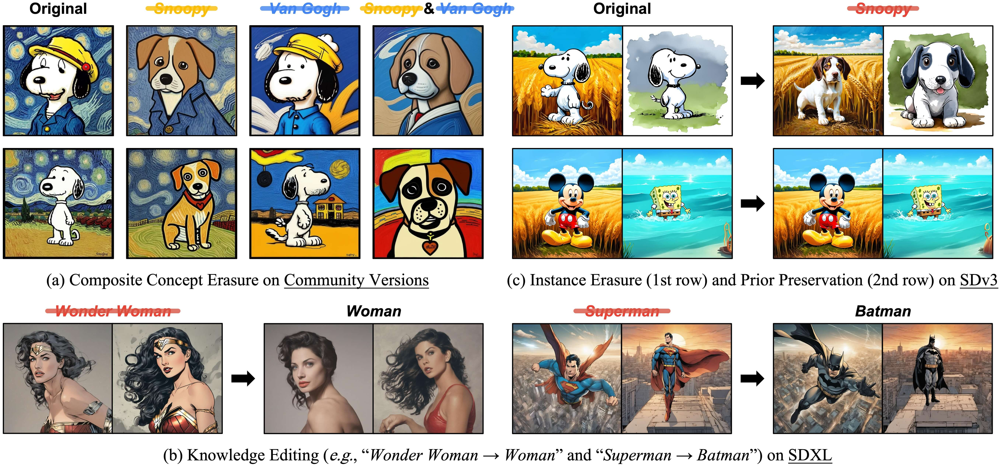

# SPEED
This is the official Pytorch implementation of our paper:

> [SPEED: Scalable, Precise, and Efficient Concept Erasure for Diffusion Models](https://arxiv.org/abs/2503.07392)
>
> Ouxiang Li, Yuan Wang, Xinting Hu, Houcheng Jiang, Tao Liang, Yanbin Hao, Guojun Ma, Fuli Feng

<p align="center">
  <a href='https://arxiv.org/abs/2503.07392v2'>
    
  </a>
  <a href='https://huggingface.co/lioooox/SPEED'>
    
  </a>
</p>



**Three characteristics of our proposed method, SPEED.**  **(a) Scalable:** SPEED seamlessly scales from single-concept to large-scale multi-concept erasure (e.g., 100 celebrities) without additional design.  **(b) Precise:** SPEED precisely removes the target concept (e.g., *Snoopy*) while preserving the semantic integrity for non-target concepts (e.g., *Hello Kitty* and *SpongeBob*).  **(c) Efficient:** SPEED can immediately erase 100 concepts within 5 seconds, achieving a ×350 speedup over the state-of-the-art (SOTA) method.

## 📣 News
- `2026/01` 🎉 Our paper is accepted to ICLR 2026. The camera-ready version will be updated soon.
- `2025/03` 🌟 Code and checkpoints are released.

## 📄 Requirements

Install the environment as follows:

```python
# create conda environment
conda create -n SPEED -y python=3.10
conda activate SPEED
# install pytorch 
pip install torch==2.3.0 torchvision==0.18.0
# install other dependencies
pip install -r requirements.txt
```

## 🔥 Concept Erasure with SPEED

### Model Editing

```python
# Instance Erasure
CUDA_VISIBLE_DEVICES=0 python train_erase_null.py \
    --target_concepts "Snoopy, Mickey, Spongebob" --anchor_concepts "" \
    --retain_path "data/instance.csv" --heads "concept"

# Artistic Style Erasure
CUDA_VISIBLE_DEVICES=0 python train_erase_null.py \
    --target_concepts "Van Gogh" --anchor_concepts "art" \
    --retain_path "data/style.csv" --heads "concept"

# 10-Celebrity Erasure
CUDA_VISIBLE_DEVICES=0 python train_erase_null.py \
    --target_concepts "Adam Driver, Adriana Lima, Amber Heard, Amy Adams, Andrew Garfield, Angelina Jolie, Anjelica Huston, Anna Faris, Anna Kendrick, Anne Hathaway" \
    --anchor_concepts "person" \
    --retain_scale 0.05 --disable_filter \
    --retain_path "data/10_celebrity.csv" --heads "concept"
```

Since the retain set for multi-concept erasure includes only 100 celebrities following MACE, which does not reach rank saturation, we specify `--disable_filter` to disable the initial filter with IPF. This results in $\mathbf{R}_\text{refine} = \mathbf{R} \cup \left(\mathbf{R}\right)^{\text{aug}}_f$. 

The edited checkpoints will be saved at `logs/checkpoints` by default, you can alternatively specify `--save_path` to your preferred path.

### Image Sampling

```python
# Instance Erasure
CUDA_VISIBLE_DEVICES=0 python sample.py \
    --erase_type 'instance' \
    --target_concept 'Snoopy, Mickey, Spongebob' \
    --contents 'Snoopy, Mickey, Spongebob, Pikachu, Hello Kitty' \
    --mode 'original, edit' \
    --edit_ckpt '{checkpoint_path}' \
    --num_samples 10 --batch_size 10 \
    --save_root 'logs/few-concept/instance'

# Artistic Style Erasure
CUDA_VISIBLE_DEVICES=0 python sample.py \
    --erase_type 'style' \
    --target_concept 'Van Gogh' \
    --contents 'Van Gogh, Picasso, Monet, Paul Gauguin, Caravaggio' \
    --mode 'original, edit' \
    --edit_ckpt '{checkpoint_path}' \
    --num_samples 10 --batch_size 10 \
    --save_root 'logs/few-concept/style'

# 10-Celebrity Erasure
CUDA_VISIBLE_DEVICES=0 python sample2.py \
    --erase_type "10_celebrity" \
    --target_concept "10_celebrity" \
    --contents "erase, retain" \
    --mode "original, edit" \
    --edit_ckpt '{checkpoint_path}' \
    --num_samples 1 --batch_size 10 \
    --save_root "logs/multi_celebrity"
```

In the command above, you can configure the `--mode` to determine the sampling mode:

- `original`: Generate images using the original Stable Diffusion model.
- `edit`: Generate images with the erased checkpoint.


## 📏 Metrics Evaluation

### Pre-trained Model Sampling

We first generate images from the pre-trained model as a baseline for subsequent comparisons, and these images are also used to calculate FID.

```python
bash data/pretrain/pretrain_sample.sh
```

This script facilitates to sample the original images on few-concept erasure (`instance`, `style`), multi-concept (`10/50/100 celebrities`) erasure, and MS-COCO generations (`coco`).

### On Few-Concept Erasure

You can directly reproduce our results using this script, which consists three steps: (1) model editing, (2) image sampling, and (3) evaluation (CS and FID).

```python
bash scripts/eval_few.sh
```

### On Multi-Concept Erasure

This script consists of two steps: (1) model editing and (2) image sampling.

```python
bash scripts/eval_multi.sh
```

In evaluation, we follow MACE's setup by introduing `GIPHY Celebrity Detector`, you can refer to the [GCD installation guideline](https://github.com/Shilin-LU/MACE/tree/main/metrics) and then calculate the GCD accuracy for both `erase` and `retain` sets.

```python
conda activate GCD
CUDA_VISIBLE_DEVICES=0 python metrics/evaluate_by_GCD.py --image_folder '{image_folder_path}'
```

### On Implicit Concept Erasure

You can directly run the following script for fast evaluation, which consists of: (1) model editing, (2) I2P & MS-COCO image sampling, and (3) NudeNet detection & MS-COCO evaluation.

```python
bash scripts/eval_nudity.sh
```


## 🟨 Model Card

We provide several edited models with SPEED on Stable Diffusion v1.4.

| Concept Erasure Task | Edited Model |
|---|---|
| Few-Concept Erasure | <a href='https://huggingface.co/lioooox/SPEED/tree/main/few-concept' style="margin: 0 2px; text-decoration: none;"></a> |
| Multi-Concept Erasure | <a href='https://huggingface.co/lioooox/SPEED/tree/main/multi-concept' style="margin: 0 2px; text-decoration: none;"></a> |
| Implicit Concept Erasure | <a href='https://huggingface.co/lioooox/SPEED/tree/main/nudity' style="margin: 0 2px; text-decoration: none;"></a> |


## 📊 More Applications

Our method can adapt to other T2I models across versatile applications.



## ✍️ Citation
If you find the repo useful, please consider citing.
```
@article{li2025speed,
  title={Speed: Scalable, precise, and efficient concept erasure for diffusion models},
  author={Li, Ouxiang and Wang, Yuan and Hu, Xinting and Jiang, Houcheng and Liang, Tao and Hao, Yanbin and Ma, Guojun and Feng, Fuli},
  journal={arXiv preprint arXiv:2503.07392},
  year={2025}
}
```
